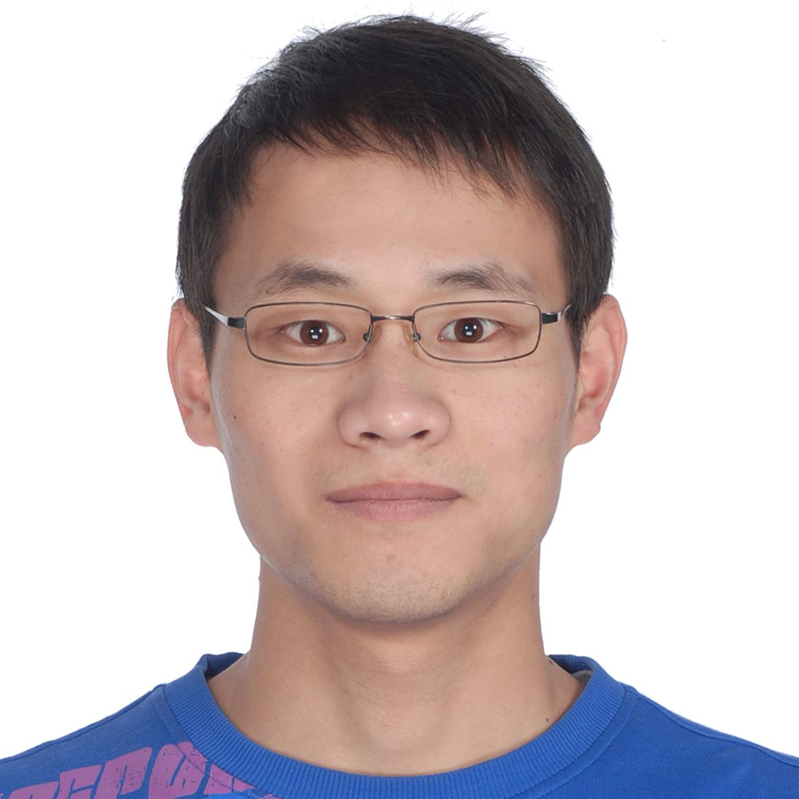

 
<ul style="list-style-type:none">
    <li style="padding-top:0.5rem;">I am currently a lecturer at <a href="https://www.qmul.ac.uk/maths/">School of Mathematical Sciences</a>, <a href="https://www.qmul.ac.uk/">Queen Mary University of London</a>. Prior to Queen Mary, I was a postdoc researcher at <a href="http://www.damtp.cam.ac.uk/">Department of Applied Mathematics and Theoretical Physics</a>, <a href="https://www.cam.ac.uk/">University of Cambridge</a>, where I was a member of <a href="http://www.damtp.cam.ac.uk/research/cia/">Cambridge Image Analysis</a> group led by <a href="http://www.damtp.cam.ac.uk/user/cbs31/Home.html">Carola Schönlieb</a>.</li>
    <li style="padding-top:10px;">I received my Ph.D. from ENSICAEN and University of Caen Normandy advised by <a href="https://fadili.users.greyc.fr/">Jalal Fadili</a> and <a href="http://gpeyre.github.io/">Gabriel Peyré</a>. I received my master degree from Shanghai Jiao Tong University under the supervision of <a href="http://math.sjtu.edu.cn/faculty/xqzhang/">Xiaoqun Zhang</a>. I obtained my bachlor degree in Electrical & Information Engineering from Nanjing University of Posts and Telecommunications.</li> 
</ul>
 

 

##### Contact
- E-mail: jl993 AT cam.ac.uk
<!-- - Office: Pav. F2.04 -->
- Address: School of Mathematical Sciences, Queen Mary University of London, London E1 4NS, UK

##### Research interests
* Non-smooth Optimization, Image Processing.

##### Short bio
- 2020-Now: Lecturer, School of Mathematical Sciences, Queen Mary University of London.
- 2019-Now: Leverhulme Early Career Fellow.
- 2017-2019: Postdoc research associate, DAMTP, University of Cambridge.
- 2013-2016: Ph.D. in Applied Mathematics, GREYC, ENSICAEN and University of Caen Normandy. 
<!-- - 2012-2013: Research intern, GREYC, ENSICAEN and University of Caen Normandy. -->
- 2010-2013: M.S. in Applied Mathematics, School of Mathematics & Institute of Natural Sciences, Shanghai Jiao Tong University. 
- 2006-2010: B.S. in Electrical & Information Engineering, School of Telecom. and Information Engineering, Nanjing University of Posts and Telecommunications.
    